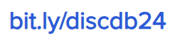

{: .welcome} 

#### Orario delle lezioni

| Giorno          | Aula |
| :-------------: |      |
| Lunedì  15-18 |  D03  | 
| Venerdì 11-14 |  IB   | 

#### Comunicazioni
{: #tag}

Durante il corso si utilizzerà **Discord** come canale principale di comunicazioni e per il supporto agli studenti.
Di seguito l'indirizzo per accedere al server del corso:

#### Lezioni

Il programma delle lezioni è provvisorio e può subire variazioni.

| Argomento                                          | Data           |Orario           | Slides                                                           | Codice/Altro|
|----------------------------------------------------|----------------|---------------- |----------------------------------------------------------------  |-----------------|
| Introduzione Corso                                 | 08 Marzo 2024  |11-13            |[Introduzione](https://tinyurl.com/introdbpz)                     |                 | 
| Modello relazionale                                | 08 Marzo 2024  |11-13            |[Modello Relazionale](https://tinyurl.com/modelrelazionale)       |                 | 
| Algebra relazionale                                | 11 Marzo 2024  |15-17            |[Algebra Relazionale](https://tinyurl.com/algebrarel)             |                 |
| Esercitazione Algebra relazionale                  | 15 Marzo 2024  |11-14            |[Testo 1](https://tinyurl.com/es1alrel)  [Soluzione1](https://tinyurl.com/es1sol)  [Testo 2](https://tinyurl.com/es2alrel) [Soluzione2](https://tinyurl.com/es2sol)                                                                                    |[How To Use Relax](https://tinyurl.com/howuserelax)                 |
| SQL: Concetti di base + MySQL                      | 18 Marzo 2024  |15-17            | [SQL Concetti base](https://studentiunict-my.sharepoint.com/:b:/g/personal/concetto_spampinato_unict_it/Ea7PWN6Wr0RMuOPT3IpQJaQB3Cu2c1slBgImgfDWljRvzw?e=WoQl8g)                                     | [MySQL](https://studentiunict-my.sharepoint.com/:b:/g/personal/concetto_spampinato_unict_it/EadHbKXAMgVApYI3uqVpxLEBGqaffU0fWKpWTGmA5JK1hA?e=9ddYZ9)                |
| SQL Operatori Aggregati + Esercitazione MySQL Base | 22 Marzo 2024  |11-14            |[Esercitazione](https://studentiunict-my.sharepoint.com/:b:/g/personal/concetto_spampinato_unict_it/EYomLvIYdZdFrSCrgUi8sgwB-osojBEKKIEzvFc4U8fqrg?e=OBxX0r) [Soluzione](https://tinyurl.com/soles2)  [SQL Op. Aggr.](https://studentiunict-my.sharepoint.com/:p:/g/personal/concetto_spampinato_unict_it/EeUZ50BKc6tDgr0NlREG7dkBuX6VvBTQc9Ghx7HTP9vpvg?e=RXTAA5) | [dati eserc](https://studentiunict-my.sharepoint.com/:u:/g/personal/concetto_spampinato_unict_it/EVnFlL0oCcRDocDIUbh2DVYBgHk9haR9ENOWSNvYNzKiLg?e=k45DeI)                |
| SQL Query Nidificate + Esercitazione op. aggregati | 25 Marzo 2024  |15-18            | [SQL Query nidificate](https://tinyurl.com/sqlnidif)   [Esercizio 1](https://tinyurl.com/es2sqlopaggr) [Soluzione1](https://tinyurl.com/sol12503)   [Esercizio 2](https://tinyurl.com/es1sql2) [Soluzione2](https://tinyurl.com/sol22503)| [dati1](https://tinyurl.com/esdati2)   [dati2](https://tinyurl.com/es1sqldati)       |
| SQL Avanzato: Stored Procedure e Trigger           | 29 Marzo 2024  |11-13            | [Procedure e Trigger](https://tinyurl.com/proctrigg)       |                 |
| Esercitazione Procedure + Trigger                  | 05 Aprile 2024 |11-14            | [Esercizio](https://studentiunict-my.sharepoint.com/:b:/g/personal/f_proiettosalanitri_unict_it/EUovAMSW7M9JraqAj1oxCLEB7-TMDAHX1XvVI9vIck1Jdw?e=F8gA3Q)                                | [dati](https://studentiunict-my.sharepoint.com/:u:/g/personal/f_proiettosalanitri_unict_it/Ee1eKAYAxYpGkIwmr6vGKHYBiUh7DS5jruTUVg8Z2t7YLA?e=4GutQw)                 |
| Esercitazione  Complessiva SQL - 1                 | 08 Aprile 2024 |15-18            |                                 |                 |
| Esercitazione  Complessiva SQL - 2                 | 12 Aprile 2024 |11-14            |                                 |                 |
| Simulazione Prova in itinere                       | 15 Aprile 2024 |15-18            |                                 |                 |
| **Prova in itinere  SQL**                          | 19 Aprile 2024 |TBD              |                                 |                 |
| NoSQL                                              | 03 Maggio 2024 |11-13            |                                 |                 |
| Esercitazione NoSQL                                | 06 Maggio 2024 |15-18            |                                 |                 |
| Progettazione Concettuale                          | 13 Maggio 2024 |11-13            |                                 |                 |
| Esempi progettazione concettuale                   | 17 Maggio 2024 |15-18            |                                 |                 |
| Progettazione logica                               | 20 Maggio 2024 |15-17            |                                 |                 |
| Esercitazione progettazione logica                 | 24 Maggio 2024 |11-14            |                                 |                 |
| Esercitazione progettazione                        | 27 Maggio 2024 |15-19            |                                 |                 |
| Esercitazione progettazione                        | 31 Maggio 2024 |11-14            |                                 |                 | 
| **Prova in itinere Progettazione**                 | 07 Giugno 2024 |TBD              |                                 |                 | 
        
#### Esami

Gli studenti che **frequentano** il corso possono partecipare alle due prove in itinere, che saranno svolte durante il periodo delle lezioni: 1) prova pratica di SQL; 2) prova di progettazione.

Qualora una delle due prove in itinere previste non venisse superata, potrà essere recuperata **solo** durante il primo appello della materia.  

In alternativa, è possibile sostenere una prova integrata nelle date degli appelli ufficiali del corso, disponibili [qui](https://www.dieei.unict.it/sites/default/files/files/CalendarioEsami_L8INF_2023-2024_v2.pdf).
La prova integrata consiste nella progettazione di una base di dati, a partire dai requisiti forniti, e la successiva implementazione in SQL.

In tutti i casi, è **obbligatoria** la prenotazione tramite il Portale studenti o Studium (secondo indicazioni dei docenti).

#### Prove in itinere
**Prova in itinere 1: SQL**
L'accesso alla prova in itinere è subordinato alla consegna di:
  - almeno 2 delle 3 esercitazioni che verranno svolte in aula. La consegna delle esercitazioni deve avvenire alla fine della lezione stessa.

|#      | Esercitazioni                             | Data Esercitazione | 
|------ | ----------------------------------------- | -----------------  | 
| 1     | Esercitazione  Complessiva SQL - 1        | 08 Aprile 2024     | 
| 2     | Esercitazione  Complessiva SQL - 2        | 12 Aprile 2024     | 
| 3     | Simulazione Prova in itinere              | 15 Aprile 2024     |
    
  - almeno 4 dei 5 homework che verranno assegnati durante la prima metà del corso
    
|#      | Homework                                                     | Data Assegnazione | Data Consegna    |
|------ | ------------------------------------------------------------ | ----------------  | ---------------- |
| 1     | [Algebra Relazionale](https://tinyurl.com/relalghw1)         | 15 Marzo 2024     | 22 Marzo 2024    |
| 2     | [MySQL Base](https://tinyurl.com/hw2sql)                     | 22 Marzo 2024     | 29 Marzo 2024    |
| 3     | [SQL Operatori Aggregati](https://tinyurl.com/hw3aggr)       | 28 Marzo 2024     | ~~04 Aprile 2024~~ 08 Aprile 2024  |
| 4     | [Procedure e Trigger](https://tinyurl.com/hw4trigger)        | 29 Marzo 2024     | ~~09 Aprile 2024~~ 15 Aprile 2024  |

#### Contatti e ricevimento

- [Concetto Spampinato](mailto:concetto.spampinato@unict.it)
Gli orari di ricevimento sono i seguenti:
  - martedì, dalle 10 alle 12
  - giovedì, dalle 10 alle 12
- [Federica Proietto Salanitri](mailto:federica.proiettosalanitri@unict.it)
  - mercoledì, dalle 17 alle 18

I ricevimenti possono essere tenuti in presenza, presso il Polo Tecnologico, Lab. Mednetna, o online.
È consigliabile contattare il docente via e-mail prima di presentarsi al ricevimento, per ogni evenienza.
